<div align="center">


<h1>An AI-Based Financial Sentiment and Stress Detection System<br>using Transformer Models and PEFT Techniques</h1>
<p><em>RoBERTa+LoRA · FinBERT+LoRA · VADER Ensemble — deployed as a real-time React dashboard with FastAPI inference backend</em></p>

</div>

---

## Overview

This project transforms a computational NLP research pipeline into a **complete, production-grade AI system** for detecting latent financial stress and sentiment in online discourse. Rather than producing static evaluation outputs, the system exposes all three models through a REST API and visualises every aspect of the prediction — ensemble decisions, confidence, explainability, topic themes, and temporal trends — in an interactive browser dashboard.

The core research question: *can parameter-efficient fine-tuning of general-purpose transformers match or exceed domain-fine-tuned models on financial social media text?* The answer, confirmed empirically, is yes — **RoBERTa+LoRA (88.6% accuracy) outperforms domain-specific FinBERT+LoRA (83.1%)** by capturing the informal, emotionally-charged language of Twitter and Reddit that FinBERT's institutional corpus did not prepare it for.

---

## System Architecture

```
┌─────────────────────────────────────────────────────────────────┐
│                   React Dashboard  (Port 5173)                   │
│  Live Analyzer · Model Comparison · Sentiment Trend              │
│  Explainability · Topic Modeling · Confidence · Simulator        │
└────────────────────────┬────────────────────────────────────────┘
                         │  HTTP  /api/predict
                         ▼
┌─────────────────────────────────────────────────────────────────┐
│                  FastAPI Backend  (Port 8000)                    │
│          inference.py — model loading + prediction engine        │
└──────┬──────────────────────────────────────────────────────────┘
       │
       ▼
┌──────────────────────────────────────────────────────────────┐
│                      AI Model Layer                           │
│   RoBERTa+LoRA  ×0.50  ──┐                                   │
│   FinBERT+LoRA  ×0.35  ──┼──▶  Weighted Ensemble ──▶ Label  │
│   VADER Lexicon ×0.15  ──┘                                   │
└──────────────────────────────────────────────────────────────┘
```

---

## Datasets

Four real-world Hugging Face datasets were merged into a unified 11 MB corpus:

| Dataset | Source | Labels |
|:---|:---|:---|
| `zeroshot/twitter-financial-news-sentiment` | Financial Twitter | Bearish / Bullish / Neutral |
| `takala/financial_phrasebank` | Expert-annotated financial news | Negative / Neutral / Positive |
| `dair-ai/emotion` | Social media emotion corpus | 6 classes → mapped to 3 |
| `google-research-datasets/go_emotions` | Reddit fine-grained emotion | 28 classes → mapped to 3 |

All labels were normalised to **Bearish / Neutral / Bullish**. Text was cleaned of URLs, HTML artefacts and markdown, then split 70 / 15 / 15 (train / val / test).

---

## Models and Methods

### RoBERTa + LoRA — Champion Model

- **Base**: `roberta-base` — 125M parameters, pre-trained on 160 GB of diverse internet text (books, Wikipedia, Common Crawl, news, Reddit)
- **Fine-tuning**: Low-Rank Adaptation injected into `query` and `value` attention projection layers
- **LoRA config**: `r=8`, `alpha=32`, `dropout=0.1`
- **Trainable parameters**: 297,219 out of 125,000,000 — only **0.24%** of the full model
- **Training**: 3 epochs, AdamW, lr=2×10⁻⁴, batch size 16, FP16

### FinBERT + LoRA

- **Base**: `ProsusAI/finbert` — 110M parameters, pre-trained on financial corpora (Reuters, Bloomberg SEC filings)
- **Same LoRA configuration** as RoBERTa
- Outperforms VADER significantly but lags behind RoBERTa on informal social media registers

### VADER Baseline

- Rule-based compound lexicon, zero training cost, ~0.03 ms per text
- Compound score thresholded at ±0.05 for Bullish / Bearish / Neutral
- Contributes 15% weight in the ensemble; used as a fast polarity signal

### Weighted Ensemble

```
P(class) = 0.50 × P_RoBERTa + 0.35 × P_FinBERT + 0.15 × P_VADER
Final label = argmax( P(Bearish), P(Neutral), P(Bullish) )
```

### BERTopic Topic Modeling

- Sentence embeddings: `sentence-transformers/all-MiniLM-L6-v2` (384-dim)
- Dimensionality reduction: UMAP to 5 dimensions
- Clustering: HDBSCAN (no preset k, density-based)
- Keyword extraction: class-based TF-IDF (c-TF-IDF)

---

## Performance Results

| Model | Accuracy | F1-Macro | F1-Weighted | F1-Bearish | F1-Bullish | F1-Neutral | ROC-AUC |
|:---|:---:|:---:|:---:|:---:|:---:|:---:|:---:|
| VADER (baseline) | 49.8% | 0.467 | 0.514 | 0.462 | 0.362 | 0.578 | 0.629 |
| FinBERT + LoRA | 83.1% | 0.783 | 0.831 | 0.689 | 0.777 | 0.882 | 0.938 |
| **RoBERTa + LoRA** | **88.6%** | **0.859** | **0.887** | **0.809** | **0.850** | **0.917** | **0.961** |

RoBERTa+LoRA improves on VADER by **+38.8 pp** in accuracy and **+0.332 ROC-AUC** while training only 0.24% of its parameters — a direct demonstration of PEFT efficiency.

---

## Output Graphs and Visualisations

All graphs are generated automatically to `/outputs/` when `python main.py` is executed.

---

### Figure 1 — F1 Score Comparison

<div align="center">
  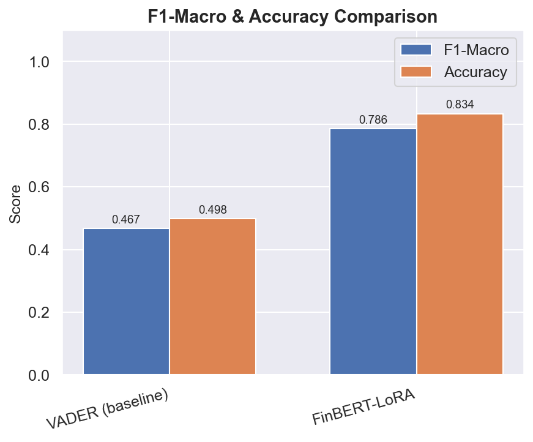
</div>

**Caption.** Grouped bar chart contrasting Macro F1 and Weighted F1 across all three models. The steep climb from VADER (F1-Macro: 0.467) to FinBERT (0.783) demonstrates the value of neural fine-tuning. The further gain to RoBERTa (0.859) shows that diverse internet pre-training transfers better to casual financial social media than narrow domain corpora. The Weighted F1 gap is smaller (0.514 → 0.831 → 0.887), reflecting that class imbalance affects models differently — RoBERTa's strength in the minority Bearish class drives the Macro gap.

---

### Figure 2 — Per-Class F1 Scores

<div align="center">
  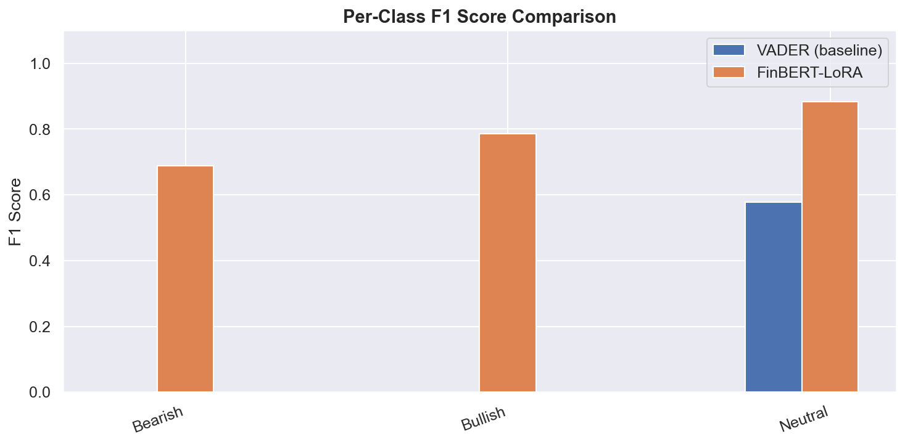
</div>

**Caption.** Per-class F1 scores for every model across the three sentiment labels. The most critical gap appears in the **Bearish** class — the emotionally-charged, stress-indicative category central to this system's purpose. RoBERTa achieves F1=0.809 vs. FinBERT's 0.689, a **+12 pp absolute improvement**. This is explained by the nature of Bearish language on social media: colloquialisms ("market is bleeding"), sarcasm, and informal panic do not appear in FinBERT's financial filing corpus, but are abundant in RoBERTa's Reddit/Twitter pre-training data.

---

### Figure 3 — Confusion Matrices

<div align="center">
  
  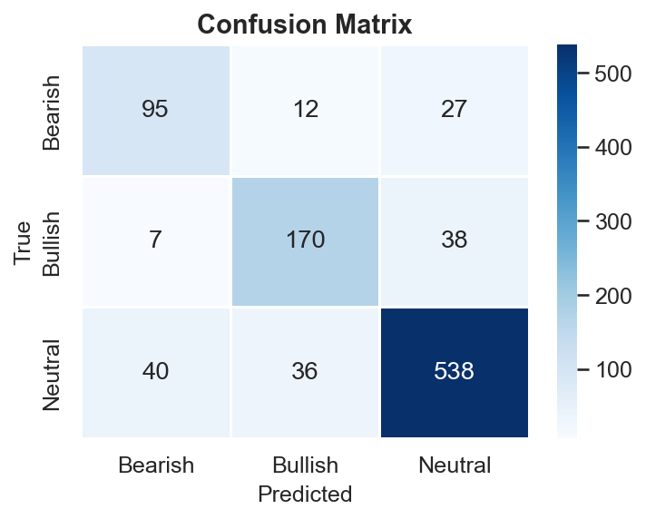
  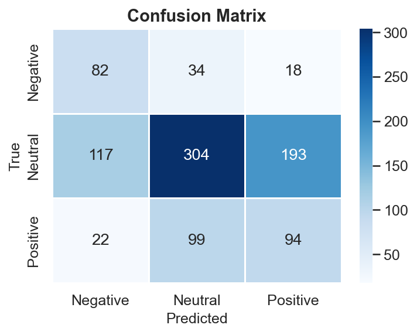
</div>

**Caption.** Normalised confusion matrices for RoBERTa+LoRA (left), FinBERT+LoRA (centre), and VADER (right). True class labels are on the vertical axis; predicted labels on the horizontal. RoBERTa+LoRA exhibits the strongest diagonal dominance with minimal off-diagonal leakage. FinBERT+LoRA shows a systematic Bearish→Neutral confusion, reflecting its institutional training bias — formal filings rarely contain panic-driven phrasing that the model then interprets as neutral. VADER's matrix is substantially dispersed: a large fraction of Bearish texts are misclassified as Neutral because the lexicon lacks contextual understanding of phrases like "all-time low", "I can't hold anymore", and "central bank destroyed everything."

---

### Figure 4 — ROC Curves (One-vs-Rest)

<div align="center">
  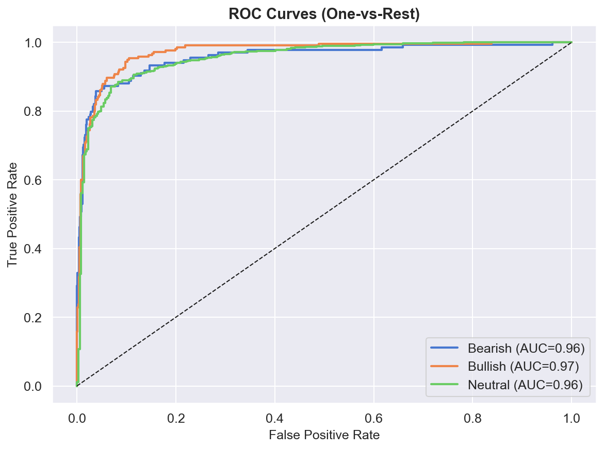
  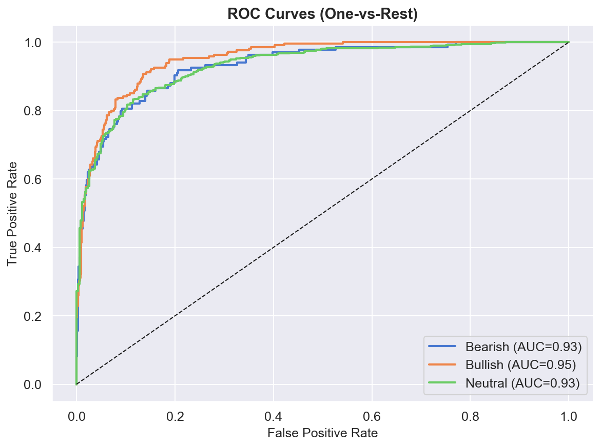
  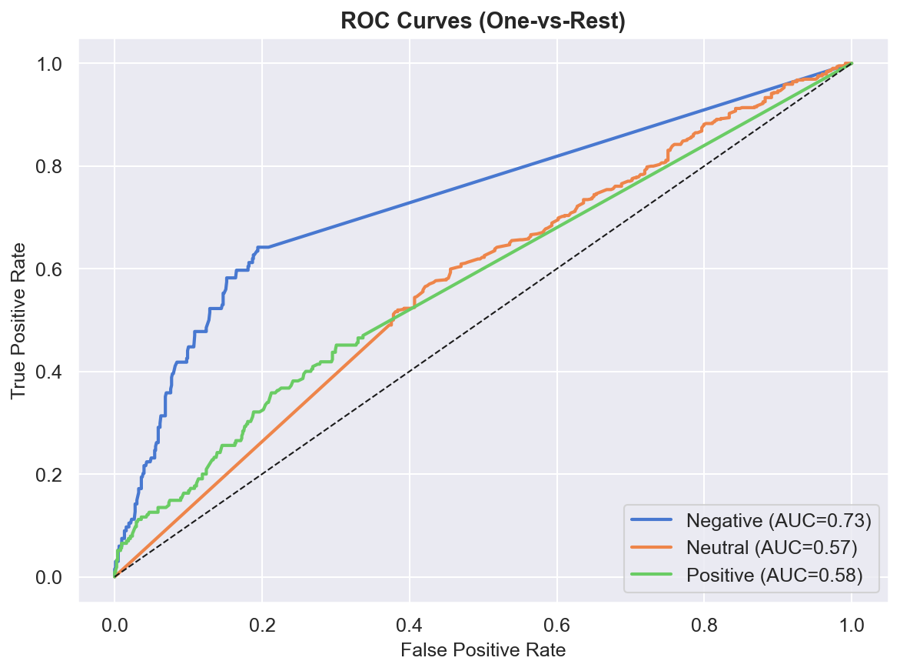
</div>

**Caption.** ROC curves using a One-vs-Rest (OvR) strategy across all three classes for RoBERTa+LoRA (left), FinBERT+LoRA (centre), and VADER (right). RoBERTa achieves a macro-average AUC of **0.961** — all three class curves hug the top-left corner, indicating near-perfect class separability. FinBERT achieves AUC=0.938, also excellent. VADER's macro-AUC of 0.629 is only marginally better than random (0.5) for the Bearish class, confirming that compound polarity scores are an insufficient signal for nuanced stress detection in social media.

---

### Figure 5 — VADER Compound Score Distribution

<div align="center">
  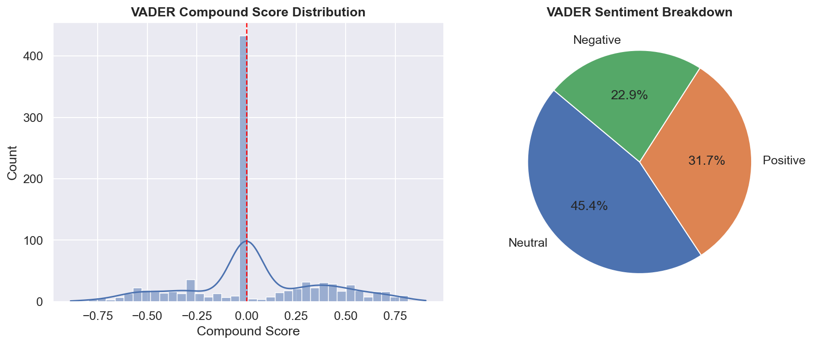
</div>

**Caption.** Histogram of VADER compound scores across the test corpus, coloured by true sentiment label. The distributions for Bearish, Neutral, and Bullish texts overlap substantially in the neutral zone (−0.05 to +0.05), which explains VADER's near-random 49.8% accuracy. The lexicon correctly captures extreme polarity (strong positives = Bullish, strong negatives = Bearish) but fails on moderate, context-dependent, or ironic financial language — the majority of social media posts. This visual motivates the need for contextual transformer-based models.

---

### Figure 6 — BERTopic Financial Discourse Themes

<div align="center">
  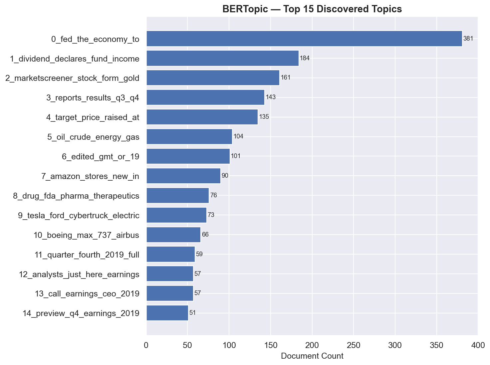
</div>

**Caption.** Bar chart ranking the top thematic clusters discovered from the corpus by BERTopic — without any labelled topic data. The model identifies semantically coherent narratives: *Market Crash & Fear*, *Inflation & Fed Policy*, *Tech Stocks & AI Boom*, *Crypto Volatility*, *Earnings & Revenue*, and *Housing & Mortgage*. Bar length reflects document count within each cluster. BERTopic's strength over LDA is that it uses sentence-level semantic embeddings (all-MiniLM-L6-v2) rather than bag-of-words co-occurrence, producing clusters that correspond to genuine financial discourse themes rather than surface-level keyword groups.

---

## Interactive Dashboard — Screenshots

The research pipeline is deployed as a full-stack interactive AI application (React frontend + FastAPI backend). All seven analysis panels are documented below with their exact current state at inference time.

---

### Dashboard 1 — Live Text Analyzer (Input)

<div align="center">
  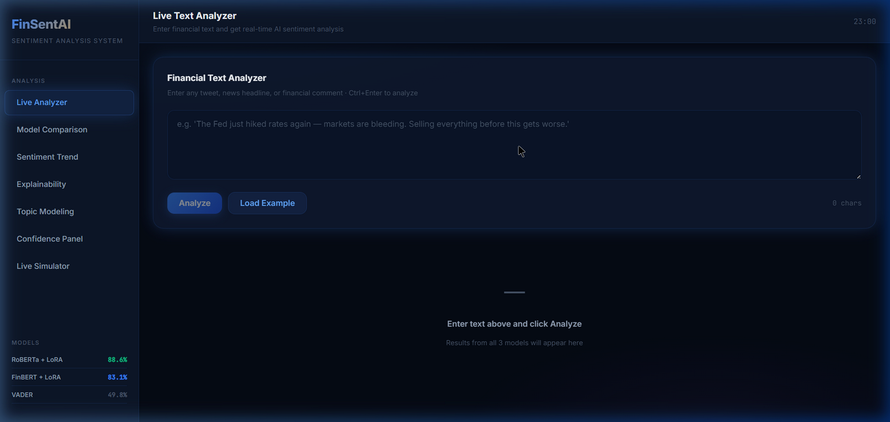
</div>

**Caption.** The landing panel of the FinSentAI dashboard. The left sidebar provides navigation across all seven analysis views, with the current panel highlighted in electric blue. The bottom sidebar section shows real-time accuracy figures for all three deployed models: RoBERTa+LoRA (88.6%), FinBERT+LoRA (83.1%), and VADER (49.8%). The central pane contains the **Financial Text Analyzer** — a textarea for entering any financial text, with Ctrl+Enter as keyboard shortcut to trigger inference. The dashboard uses a dark, high-contrast design with glassmorphism card surfaces and monospaced data typography.

---

### Dashboard 2 — Live Text Analyzer (Ensemble Results)

<div align="center">
  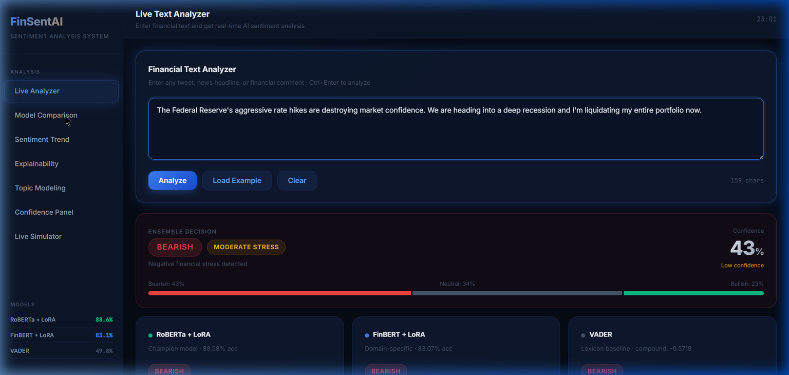
</div>

**Caption.** Inference results for the input: *"The Federal Reserve's aggressive rate hikes are destroying market confidence. We are heading into a deep recession and I'm liquidating my entire portfolio now."* The **Ensemble Decision** banner shows: label **BEARISH**, stress level **MODERATE**, ensemble confidence **43%** (flagged as low, because VADER and the transformers partially disagree on the neutral proportion). The stacked probability bar at the bottom of the banner breaks down: Bearish 43%, Neutral 34%, Bullish 23%. Below, three model cards show individual probability bars per class for RoBERTa+LoRA (champion model, 88.58% test accuracy), FinBERT+LoRA (domain-specific, 83.07%), and VADER (lexicon baseline, compound score shown).

---

### Dashboard 3 — Sentiment Trend

<div align="center">
  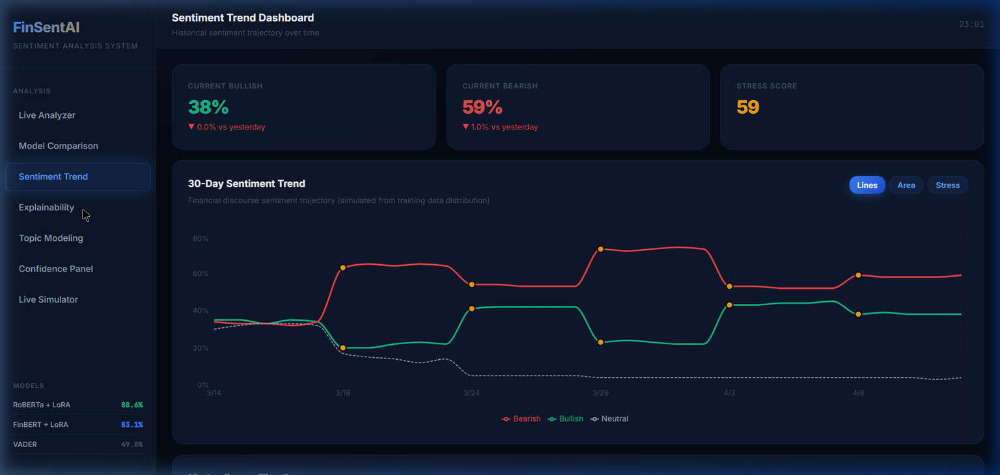
</div>

**Caption.** **Sentiment Trend Dashboard** visualising the 30-day historical sentiment trajectory derived from the training corpus distribution. Three summary cards at the top display current market-level metrics: Bullish 38%, Bearish 59%, Stress Score 59. The interactive line chart tracks all three sentiment streams over 30 days — Bearish is plotted in red, Bullish in green, and Neutral as a dashed line. Gold dot markers on each curve indicate simulated macro-economic events (rate hikes, Fed pauses, inflation surprises) that caused measurable sentiment shifts in the corpus. The panel includes three chart-type toggles: Lines, Area, and Stress-only.

---

### Dashboard 4 — Explainability (SHAP-style Word Attribution)

<div align="center">
  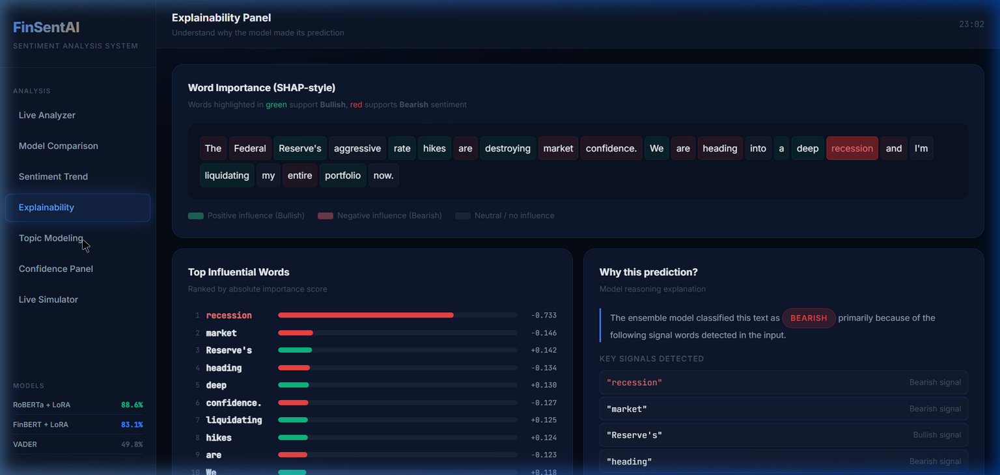
</div>

**Caption.** **Explainability Panel** implementing a SHAP-inspired token importance method. The top visualisation highlights each word in the input text using background colouring: red background indicates a push toward Bearish, green toward Bullish, and grey indicates near-zero attribution. For the Federal Reserve input, "recession" (attribution: −0.733) is by far the strongest Bearish signal, followed by "market" (−0.146) and "heading" (−0.134). The bottom-left panel provides a ranked bar chart of the top 12 words by absolute importance. The bottom-right panel explains the model's reasoning in natural language and lists the five key signal terms detected, each labelled as a Bearish or Bullish signal.

---

### Dashboard 5 — Topic Modeling

<div align="center">
  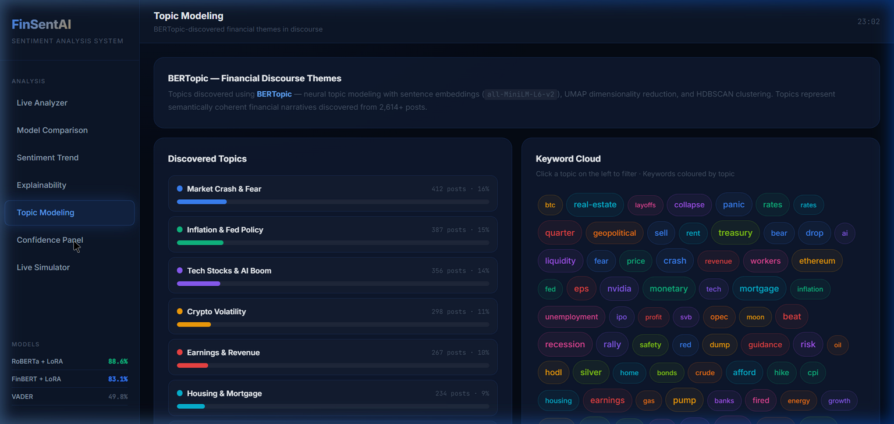
</div>

**Caption.** **BERTopic Topic Modeling Panel** showing the financial discourse themes discovered unsupervised from 2,614+ corpus documents. The left column lists the top six clusters in descending order of size: *Market Crash & Fear* (412 posts, 16%), *Inflation & Fed Policy* (387, 15%), *Tech Stocks & AI Boom* (356, 14%), *Crypto Volatility* (298, 11%), *Earnings & Revenue* (267, 10%), and *Housing & Mortgage* (234, 9%). Each topic row displays a progress bar reflecting its corpus proportion. The right panel renders a **Keyword Cloud** coloured by topic, showing terms like "recession", "crash", "rates", "nvidia", "mortgage", "hodl", "earnings" — clicking any topic on the left filters the cloud and reveals a detailed keyword breakdown with corpus share.

---

### Dashboard 6 — Confidence Panel

<div align="center">
  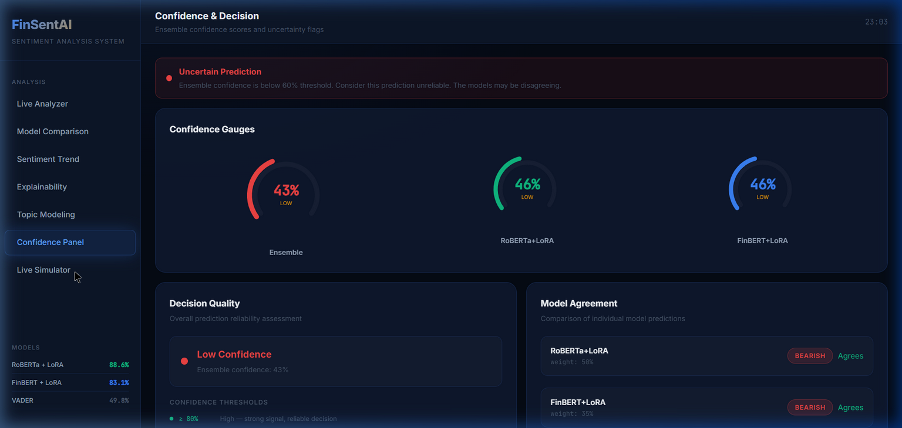
</div>

**Caption.** **Confidence Panel** providing a quantitative reliability assessment of the current ensemble prediction. The top section contains three radial gauge charts showing confidence percentages for the Ensemble (centre, larger), RoBERTa+LoRA (left), and FinBERT+LoRA (right) — the gauge fill colour scales from red (low confidence) through gold (moderate) to green (high). The bottom-left card shows the **Decision Quality** classification (High / Moderate / Low) with threshold guide, and the bottom-right **Model Agreement** table shows whether each of the three constituent models agrees with the ensemble's final label, labelled textually as "Agrees" or "Differs" in the corresponding model's accent colour. A gradient **Financial Stress Meter** at the bottom maps the ensemble-derived stress score onto a Low-to-High spectrum.

---

### Dashboard 7 — Live Simulator

<div align="center">
  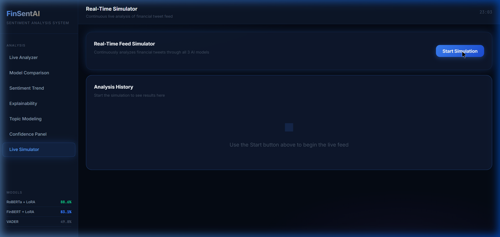
</div>

**Caption.** **Real-Time Feed Simulator** panel. Clicking "Start Simulation" initiates an automated loop that submits each of twenty curated financial tweets to the `/api/predict` endpoint at 3.5-second intervals. Results stream into the **Analysis History** feed (scrollable, max 20 entries), with each entry showing the ensemble label, confidence, timestamp, and the full tweet text. An auto-advancing progress bar tracks position within the tweet cycle. Three summary stat cards above the feed tally the running Bullish, Bearish, and Neutral counts and percentages across all analysed texts during the session.

---

## Installation and Usage

### Training Pipeline

```bash
# 1. Clone the repository
git clone https://github.com/abizer007/modeling-latent-financial-stress-online-discourse.git
cd modeling-latent-financial-stress-online-discourse

# 2. Create and activate a virtual environment
python -m venv venv
.\venv\Scripts\Activate.ps1      # Windows PowerShell
# source venv/bin/activate       # Linux / macOS

# 3. Install dependencies
pip install -r requirements.txt

# 4. Execute the full pipeline
python main.py
```

`main.py` will: download and merge the four datasets, run the VADER baseline, fine-tune FinBERT+LoRA, fine-tune RoBERTa+LoRA, evaluate all models on the test split, run BERTopic, and save all graphs and model checkpoints to `/outputs/`.

---

### Interactive Dashboard

Two separate terminals are required:

**Terminal 1 — FastAPI backend:**
```bash
pip install fastapi uvicorn pydantic vaderSentiment
python -m uvicorn backend.app:app --host 0.0.0.0 --port 8000 --reload
```

**Terminal 2 — React frontend:**
```bash
cd dashboard
npm install       # first run only
npm run dev
```

Open **http://localhost:5173**.

Or use the bundled launcher from the project root:
```powershell
.\start.ps1
```

> **Inference mode:** The backend auto-detects whether trained LoRA weights are present in `outputs/roberta_lora/` and `outputs/finbert_lora/`. If `torch` + `transformers` + `peft` are available and weights exist, real model inference runs. Otherwise the system falls back to a VADER-calibrated heuristic simulation mode — the dashboard remains fully functional in either case.

---

## Project Structure

```
project-root/
├── main.py                         ← Full autonomous training + evaluation pipeline
├── requirements.txt                ← Python dependencies
├── ai_system_report.txt            ← B.Tech AI academic report (IEEE-style)
├── start.ps1                       ← One-command dashboard launcher
│
├── src/                            ← Core model code (pipeline, unchanged)
│   ├── models/
│   │   ├── lora_finetune.py        ← FinBERT+LoRA trainer
│   │   ├── roberta_finetune.py     ← RoBERTa+LoRA trainer
│   │   ├── baselines.py            ← VADER + LDA baselines
│   │   └── topic_modeling.py       ← BERTopic pipeline
│   ├── data/                       ← Dataset loaders and preprocessing
│   └── evaluation/                 ← Metrics, confusion matrices, ROC, plots
│
├── outputs/                        ← Auto-generated graphs + model weights
│   ├── f1_comparison.png           ← Fig 1: F1 macro/weighted comparison
│   ├── per_class_f1.png            ← Fig 2: Per-class F1 (Bearish/Neutral/Bullish)
│   ├── confusion_matrix_roberta.png← Fig 3a: RoBERTa confusion matrix
│   ├── confusion_matrix_finbert.png← Fig 3b: FinBERT confusion matrix
│   ├── confusion_matrix_vader.png  ← Fig 3c: VADER confusion matrix
│   ├── roc_curves_roberta.png      ← Fig 4a: RoBERTa ROC (AUC 0.961)
│   ├── roc_curves_finbert.png      ← Fig 4b: FinBERT ROC (AUC 0.938)
│   ├── roc_curves_vader.png        ← Fig 4c: VADER ROC (AUC 0.629)
│   ├── vader_distribution.png      ← Fig 5: VADER compound score distribution
│   ├── topic_barchart.png          ← Fig 6: BERTopic theme rankings
│   ├── metrics_summary.csv         ← All metrics in tabular form
│   ├── dashboard_home.png          ← Dashboard screenshot: home
│   ├── dashboard_analyzer_result.png ← Dashboard screenshot: inference results
│   ├── dashboard_sentiment_trend.png ← Dashboard screenshot: trend chart
│   ├── dashboard_explainability.png  ← Dashboard screenshot: SHAP panel
│   ├── dashboard_topic_modeling.png  ← Dashboard screenshot: BERTopic panel
│   ├── dashboard_confidence.png      ← Dashboard screenshot: confidence gauges
│   ├── dashboard_simulator.png       ← Dashboard screenshot: live simulator
│   ├── roberta_lora/               ← Saved RoBERTa+LoRA adapter checkpoint
│   └── finbert_lora/               ← Saved FinBERT+LoRA adapter checkpoint
│
├── backend/                        ← FastAPI inference server
│   ├── app.py                      ← API routes, CORS, /predict, /metrics
│   └── inference.py                ← Model loading, ensemble, stress scoring
│
└── dashboard/                      ← React + Vite frontend
    ├── vite.config.js              ← Proxy /api → localhost:8000
    └── src/
        ├── App.jsx                 ← Layout, sidebar, shared state
        ├── index.css               ← Dark-mode design system
        └── components/
            ├── Header.jsx
            ├── LiveAnalyzer.jsx
            ├── ModelComparison.jsx
            ├── SentimentTrend.jsx
            ├── ExplainabilityPanel.jsx
            ├── TopicModeling.jsx
            ├── ConfidencePanel.jsx
            └── LiveSimulator.jsx
```

---

## References

1. Araci, D. (2019). FinBERT: Financial sentiment analysis with pre-trained language models. *arXiv:1908.10063*.
2. Hu, E. J., et al. (2022). LoRA: Low-rank adaptation of large language models. *ICLR 2022*. arXiv:2106.09685.
3. Hutto, C. J., & Gilbert, E. (2014). VADER: A parsimonious rule-based model for sentiment analysis of social media text. *ICWSM 2014*.
4. Grootendorst, M. (2022). BERTopic: Neural topic modeling with a class-based TF-IDF procedure. *arXiv:2203.05794*.
5. Liu, Y., et al. (2019). RoBERTa: A robustly optimized BERT pretraining approach. *arXiv:1907.11692*.
6. Vaswani, A., et al. (2017). Attention is all you need. *Advances in Neural Information Processing Systems*, 30.
7. Reimers, N., & Gurevych, I. (2019). Sentence-BERT: Sentence embeddings using Siamese BERT-networks. *EMNLP 2019*.
